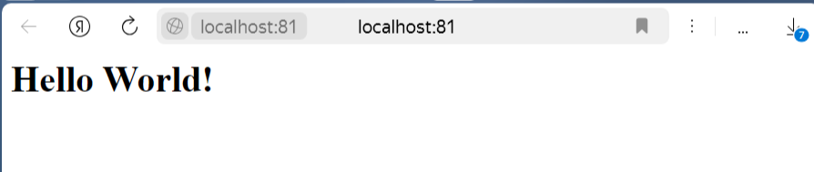
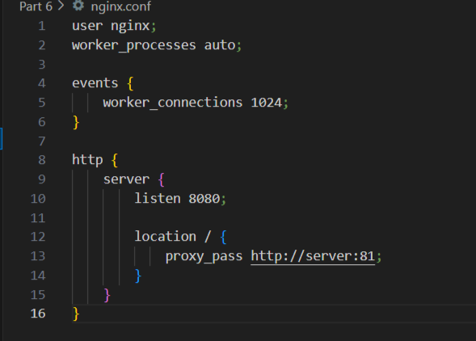

## Part 1. Готовый докер

**Возьми официальный докер-образ с nginx и выкачай его при помощи docker pull.**

Используем команду docker pull.

**Проверь наличие докер-образа через docker images.**

Используем команду docker images.

**Запусти докер-образ через docker run -d [image_id|repository].**

Используем команду docker run -d
-d: Запускает контейнер в фоновом режиме (detached mode).

**Проверь, что образ запустился через docker ps.**

Используем команду docker ps.

**Посмотри информацию о контейнере через docker inspect [container_id|container_name].**

Используем команду docker inspect [container_id|container_name].

**По выводу команды определи и помести в отчёт размер контейнера, список замапленных портов и ip контейнера.**

Используем команду docker ps -s для получения размера контейнера.

Используем команду docker port [container_id|container_name] для вывода замапленных портов.

Используем команду docker inspect -f '{{range .NetworkSettings.Networks}}{{.IPAddress}}{{end}}' [container_id|container_name] для вывода ip контейнера.
Для использования этой команды необходимо установить jq c помощью команды sudo apt-get install jq.
-f '{{range .NetworkSettings.Networks}}{{.IPAddress}}{{end}}': Формат вывода, который извлекает IP-адрес из секции NetworkSettings.Networks.

**Останови докер контейнер через docker stop [container_id|container_name].**

Используем команду docker stop [container_id|container_name].

**Проверь, что контейнер остановился через docker ps.**

Используем команду docker ps. Для большей наглядности также используем docker ps -a.

**Запусти докер с портами 80 и 443 в контейнере, замапленными на такие же порты на локальной машине, через команду run.**

Используем команду docker run -d -p 80:80 -p 443:443 nginx.

**Проверь, что в браузере по адресу localhost:80 доступна стартовая страница nginx.**

**Перезапусти докер контейнер через docker restart [container_id|container_name].**

Используем команду docker restart [container_id|container_name].

**Проверь любым способом, что контейнер запустился.**

Проверили с помощью команды docker ps.

## Part 2. Операции с контейнером

**Прочитай конфигурационный файл nginx.conf внутри докер контейнера через команду exec.**

Используем команду docker exec.

**Создай на локальной машине файл nginx.conf.**

**Настрой в нем по пути /status отдачу страницы статуса сервера nginx.**

**Скопируй созданный файл nginx.conf внутрь докер-образа через команду docker cp.**

**Перезапусти nginx внутри докер-образа через команду exec.**

**Проверь, что по адресу localhost:80/status отдается страничка со статусом сервера nginx.**

**Экспортируй контейнер в файл container.tar через команду export.**

-o container.tar: Указывает, что экспортированный контейнер должен быть сохранен в файл с именем container.tar.

**Останови контейнер.**

Используем команду docker stop [container_id|container_name].

**Удали образ через docker rmi [image_id|repository], не удаляя перед этим контейнеры.**

Используем команду docker rmi -f [image_id|repository].
Флаг -f (--force) позволяет принудительно удалить образ, даже если существуют контейнеры, использующие этот образ.
Проверяем, что образ был успешно удален, используя команду docker images

**Удали остановленный контейнер.**

Используем команду docker rm [container_id|container_name].

**Импортируй контейнер обратно через команду import.**

Используем команду docker import container.tar [new_image_name].
Проверяем, что новый образ был успешно создан, используя команду docker images.

**Запусти импортированный контейнер.**

Используем команду docker run -d -p 80:80 [new_image_name] nginx -g 'daemon off;'.
nginx -g 'daemon off;': Явно указывает команду, которая будет выполнена внутри контейнера.
Проверяем статус контейнера с помощью docker ps.

**Проверь, что по адресу localhost:80/status отдается страничка со статусом сервера nginx.**

## Part 3. Мини веб-сервер

**Напиши мини-сервер на C и FastCgi, который будет возвращать простейшую страничку с надписью Hello World!.**

Создаем новый контейнер на 81 порту.

**Запусти написанный мини-сервер через spawn-fcgi на порту 8080.**

Копируем файл mini-server.c из нашей директории server в директорию home контейнера.

С помощью команды docker exec -it [container_id|container_name] bash запускаем интерактивный терминал внутри работающего контейнера.
-it: поддержка интерактивного режима.
bash: запуск терминала bash.
Используем apt update, чтобы обновиться.

Устанавливаем библиотеки gcc, spawn-fcgi и libfcgi-dev c помощью команды apt install.

Переходим в директорию home нашего контейнера и компилируем файл mini-server.c.
Запускаем сервер на порту 8080 через spawn-fcgi.

**Напиши свой nginx.conf, который будет проксировать все запросы с 81 порта на 127.0.0.1:8080.**

Копируем файл конфигурации из нашей директории server в директорию /etc/nginx контейнера.

Перезагружаем конфигурации nginx.

**Проверь, что в браузере по localhost:81 отдается написанная тобой страничка.**

**Положи файл nginx.conf по пути ./nginx/nginx.conf (это понадобится позже).**

## Part 4. Свой докер

#### Напиши свой докер-образ, который:

**1) собирает исходники мини сервера на FastCgi из Части 3;**

**2) запускает его на 8080 порту;**

**3) копирует внутрь образа написанный ./nginx/nginx.conf;**

**4) запускает nginx.**

Создаем Dockerfile.
FROM: Указывает базовый образ, на основе которого будет построен новый образ.
WORKDIR: Устанавливает рабочую директорию для последующих инструкций.
COPY: Копирует файлы и директории из хоста в контейнер.
RUN: Выполняет команду в контейнере во время сборки образа.
ENTRYPOINT: Указывает команду, которая будет выполнена при запуске контейнера.
Также создаем bash-скрипт и отдельно в нем прописываем команду для запуска сервера на порту 8080. Таким образом, мы используем JSON-формат, для избежания конфликтов.

**Собери написанный докер-образ через docker build при этом указав имя и тег.**

**Проверь через docker images, что все собралось корректно.**

**Запусти собранный докер-образ с маппингом 81 порта на 80 на локальной машине и маппингом папки ./nginx внутрь контейнера по адресу, где лежат конфигурационные файлы nginx'а (см. Часть 2).**

Флаг -v создает тома.

**Проверь, что по localhost:80 доступна страничка написанного мини сервера.**

**Допиши в ./nginx/nginx.conf проксирование странички /status, по которой надо отдавать статус сервера nginx.**

**Перезапусти докер-образ.**

**Проверь, что теперь по localhost:80/status отдается страничка со статусом nginx**

## Part 5. Dockle

**Просканируй образ из предыдущего задания через dockle [image_id|repository].**

Устанавливаем Dockle.

Запускаем проверку Docker-образа.
Так как образ создается на основе официальной последней версии nginx, в Dockerfile которой используются NGINX_GPGKEY, NGINX_GPGKEY_PATH и NGINX_GPGKEYS, а Dockle в CIS-DI-0010 ищет ключевые слова (key, password), то это приводит к ложным срабатываниям. Поэтому запустим dockle с флагом -ak.

**Исправь образ так, чтобы при проверке через dockle не было ошибок и предупреждений.**

Так как ошибок и предпреждений от Dockle не было, просто копируем Part 4 в Part 5 и запускаем.

## Part 6. Базовый Docker Compose

**Напиши файл docker-compose.yml, с помощью которого:**

**1) Подними докер-контейнер из Части 5 (он должен работать в локальной сети, т. е. не нужно использовать инструкцию EXPOSE и мапить порты на локальную машину).**

**2) Подними докер-контейнер с nginx, который будет проксировать все запросы с 8080 порта на 81 порт первого контейнера.**

Создаем файл docker-compose.yml в директории src.
services: Определяет сервисы, которые будут запущены.
build: Указывает, как построить образ для сервиса.

Создаем Dockerfile, nginx.conf и bash-скрипт.

**Замапь 8080 порт второго контейнера на 80 порт локальной машины.**

**Останови все запущенные контейнеры.**

Проверяем, что все контейнеры остановлены.

**Собери и запусти проект с помощью команд docker-compose build и docker-compose up.**

**Проверь, что в браузере по localhost:80 отдается написанная тобой страничка, как и ранее.**

